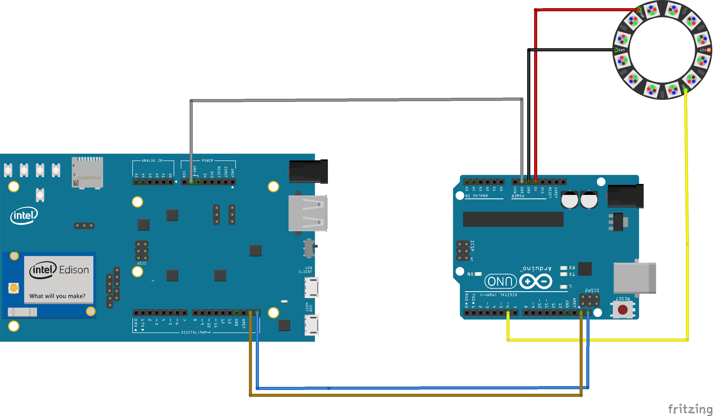

# Neopixels-and-Intel-Edison

There seems to be no library available for Intel Edison to run Neopixels right now. We can use an Arduino Uno to control the neopixels, controlled by Intel Edison as the master

Upload the master code into Edison, and the slave code in Arduino, and connect both to a power supply. On receiving the integer 0, the Neopixel ring should light up green
